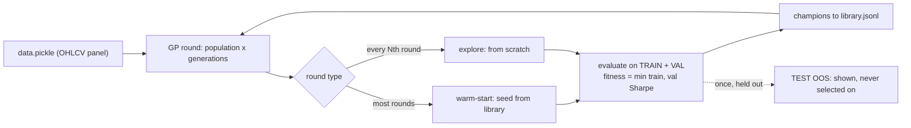

# AlphaNode — User Guide

A start-to-finish walkthrough: what AlphaNode is, **how it works**, and **how to use it** — from first
launch to acting on a mined alpha. If you just want to run it, jump to [Install](#1-install) →
[Your first search (GUI)](#4-your-first-search-gui). For the mechanism, read
[How it works](#how-it-works) first.

> This guide is the map. The deep dives live in
> [`README.md`](../README.md) (overview), [`alphanode/README.md`](../alphanode/README.md) (node/GUI/CLI/Docker),
> [`evolution/README.md`](../evolution/README.md) (the search engine and DSL), and
> [`packaging/README.md`](../packaging/README.md) (building the desktop app).

---

## What it is

AlphaNode **mines trading signals**. It runs genetic-programming search over a large space of
alpha-signal *formulas*, scores each one through a real portfolio simulator, and accumulates the robust
survivors into a growing library — the way a miner produces hashes, only here the output is **alpha
formulas** with an honest held-out track record.

You drive the same engine three ways:

| | Best for |
|---|---|
| **Desktop GUI** (`alphanode/alphanode_gui.py`) | Interactive use — settings, live leaderboard, equity charts, portfolio, paper trade, signals |
| **CLI** (`alphanode/cli.py`) | Servers / ssh / cron — headless search and inspection |
| **Docker** (`docker-compose.yml`) | "Always on in the background" with a browser status page |

> ⚠️ Everything here is a **hypothetical backtest**, not investment advice. Any formula must be verified
> with a forward/paper test on **new** data before it means anything. See `disclaimer.txt`.

---

## How it works

### The one idea

The entire "DNA" of a strategy is a **single formula** that turns OHLCV into a per-instrument signal —
e.g. `ts_zscore(close,14)` (Bollinger) or `sign(sub(ts_mean(close,10),ts_mean(close,20)))` (MA-cross).
Everything else — inverse-volatility sizing, forecast normalization, vol-targeting, position inertia,
fees — is the engine's **fixed machinery**. So the search space **strictly contains** the classic
hand-written strategies, and can beat them. The grammar is 38 operators over OHLCV + derived terminals
(`vwap/range/body/dvol/logret`); the full DSL is in [`evolution/README.md`](../evolution/README.md).

### The search loop

The node runs in **rounds**, forever by default (`max_rounds = 0`). Each round is one GP run of
`population × generations` candidates:



- **Warm-start** rounds seed the population with the best alphas found so far → fine-tune and refine.
- **Explore** rounds (every `explore_every`-th, 4th by default) start from scratch → escape local optima.
- The best-of-all-time accumulates in `library.jsonl` and is **never lost** across restarts.

### Anti-overfitting is the whole point

Searching millions of formulas is a perfect machine for data-snooping, so the engine is built to resist it:

1. **Three chronological segments.** `TRAIN` (evolution) → `VAL` (robustness) → **`TEST` held out**, touched
   exactly once at the end.
2. **Fitness = `min(train_Sharpe, val_Sharpe)`.** A strategy is only as good as its *worst* segment — the
   search is rewarded for robustness, not curve-fitting. This single number is the champion's **`base`**.
3. **TEST is never used for selection, ranking, or seeding.** It is computed once and shown only as an
   honest out-of-sample estimate (`TEST OOS`). Rank or seed by TEST over hundreds of rounds and it silently
   becomes an optimization target — the result then looks unrealistically good.
4. **Complexity penalty** (parsimony) → simple beats complex.
5. **Correlation dedup** → a diverse Hall of Fame, not 12 clones of one MA-cross.
6. **Degeneracy filter** → a signal must actually trade (≥10% of days) to count.

> **Read the results with a discount.** The more formulas explored, the more optimistic the best TEST
> Sharpe is (multiple testing). TEST is an *estimate*, not a guarantee — the real check is a forward/paper
> run on **new** data. See [Reading the results honestly](#9-reading-the-results-honestly).

### Speed

The real pandas simulator is ~32 s/genome — far too slow to search thousands of formulas. The search runs
on `fastsim.py`, a numpy port of the same loop (~0.2 s/genome, ×110), cross-checked against the real engine
(corr ≥ 0.99). Champions are then **re-verified on the real engine**.

---

## 1. Install

**Option A — packaged app (nothing to install).** Grab a build and run it:

- **Ubuntu/Debian:** `sudo apt install ./alphanode_<ver>_amd64.deb` → menu entry *AlphaNode*, or the
  `alphanode` command in a terminal.
- **Any Linux:** run the single-file `AlphaNode-x86_64.AppImage`.
- **Windows:** `AlphaNode-Setup.exe` (or the portable zip).

**Option B — from source.** Needs Python 3.10+, a virtualenv with `numpy` / `pandas` / `matplotlib`, and
`python3-tk` for the GUI. A snapshot of ~50 pairs ships in `data.pickle`, so it works out of the box.

```bash
.venv/bin/python alphanode/alphanode_gui.py      # desktop GUI
.venv/bin/python alphanode/cli.py status         # or headless
```

---

## 2. The mental model in one screen

- You **start the node**; it searches in the background and keeps finding alphas.
- Everything it finds lands in a **library** (`alphanode/state/library.jsonl`), ranked by honest fitness.
- You **read** the library in the leaderboard, **inspect** any alpha's equity curve, **combine** the best
  into a portfolio, and **act** on them — export a paper-trading bundle or serve a live signal.
- `TEST` numbers are shown everywhere but are **held out** — treat them as an honest estimate, never a target.

---

## 3. Get data (optional)

The bundled `data.pickle` (~50 pairs) works immediately. To search a **live universe**, pull the top-N USDT
perpetuals by 24h turnover (public Binance endpoints, no keys):

```bash
.venv/bin/python fetch_data.py --top 150 --min-years 3    # atomically overwrites data.pickle
```

or the **⟳ Update data.pickle** button in the GUI. Young listings are filtered out (`--min-years`) so the
search window isn't mostly NaN. **After changing the universe, clear the history and restart the search** —
the old library was mined on different pairs.

---

## 4. Your first search (GUI)

```bash
.venv/bin/python alphanode/alphanode_gui.py
```

A CustomTkinter window, light or dark (the switch is in the header; it follows the OS on first run).

### 4.1 — Set it up (left panel)

The scrollable left panel holds **every** search setting, grouped:

| Section | What to set |
|---|---|
| **Resources / universe** | CPU share slider (5–95% → workers); which pairs (all, or a custom list) |
| **Search** | population, generations, seed, pause between rounds, status port |
| **Node mode** | `explore every N`, warm-start on/off, max rounds (0 = ∞), leaderboard size |
| **Simulation** | target volatility, fee |
| **Genome** | max formula depth / size (the main complexity limiters) |
| **Selection (GA)** | tournament, elitism, random injection, crossover fraction |
| **Fitness** | complexity penalty, correlation threshold/penalty, Hall-of-Fame size |
| **Date segments** | TRAIN / VAL / TEST boundaries |

Defaults are sensible — you can press **▶ Run node** straight away. **Reset to defaults** restores them.

### 4.2 — Run and watch

**▶ Run node** launches the search as a background process. The right side shows:

- **live status** — rounds done, formulas explored, alphas found;
- a **progress chart** — best fitness by round (TEST kept held-out);
- the **leaderboard** — updates as the library grows.

**■ Stop** halts the node. It writes to `alphanode/state/`, so you can stop and resume; the library persists.

### 4.3 — Read the leaderboard

By default the leaderboard lists **every alpha** in the library, scrollable. The **"families only"** switch
in the heading collapses it to the best alpha per *family* (distinct formula shapes) — a compact view for
when near-duplicates get noisy.

| Column | Meaning |
|---|---|
| **fitness** | honest `min(train,val)` Sharpe — the criterion the node selects on |
| **TEST OOS** | held-out Sharpe — an honest estimate, ⚠ *never* a selection target |
| **trades L/S** | long / short positions opened over TEST (a trade = crossing into long/short) |
| **tr/yr·a** | trades per asset per year (relative activity) |
| **win%** | share of days with a profit (daily hit-rate) |
| **formula** | the alpha itself |

- **Click a column header to sort** (click again to flip direction). Clicking **fitness** or **TEST OOS**
  also re-ranks the *population* by that key.
- Sorting by **TEST OOS** is a ⚠ **cherry-pick** — the alphas at the top have an inflated TEST by selection
  effect. Use it to look, not to choose.
- **trades L/S**, **tr/yr·a**, **win%** are computed on TEST **lazily, only for the rows on screen**, so a
  long list scrolls smoothly; they fill in as you scroll. Sorting *by* one of those columns computes it for
  the whole set first.
- **CSV** (heading button) downloads the **whole library** from disk. **Right-click → Export table (CSV)**
  saves the table **as shown** (with the trade stats for rows you've scrolled past).
- **Right-click** a row also offers *Copy formula* / *Copy formula + metrics*; **Ctrl+C** copies the formula.

### 4.4 — Inspect an alpha

**Double-click a row** to open its equity curve: growth of $1 (log scale) with **TRAIN | VAL | TEST** zones
and a **buy & hold (EW)** basket for comparison. From that window you can also **📄 Paper Trade** (build a
bundle) or **📥 Download signals (CSV)** — see [Act on a result](#6-act-on-a-result).

### 4.5 — Combine into a portfolio

The **PORTFOLIO** panel at the bottom: **▶ Build portfolio** runs the top-N library alphas through
the real `Portfolio` engine (a couple of minutes in the background) and shows the **combined
dollar-neutral equity on TEST** plus Sharpe / CAGR / MaxDD vs a buy & hold basket. The **"by"
selector** controls how the members are picked:

- **TEST** (default) — by held-out TEST Sharpe: what actually worked on the recent window.
  ⚠ The combined TEST numbers are then *optimistic* (the same window picked the members — a
  cherry-pick); treat the portfolio as a shortlist and validate it with **Paper** before sizing.
- **fitness** — by `min(train,val)`: TEST never enters selection, so the combined TEST numbers
  are a genuine out-of-sample evaluation.

Diversifying across decorrelated alphas beats any single one. From here you can also export the
portfolio's signals, paper-trade it, or serve it as one signal.

---

## 5. Same thing headless (CLI)

Everything the GUI drives, from the terminal — [`alphanode/cli.py`](../alphanode/cli.py). State lives in
`ALPHANODE_STATE_DIR` (default `alphanode/state/`), so `top`/`status` see a running node's library.

```bash
# run the search (foreground; the same knobs as the GUI, as flags)
python alphanode/cli.py run --cpu 50 --pop 200 --gens 25 --universe all --max-rounds 0 --port 8787

# inspect the library
python alphanode/cli.py top --sort fitness -n 20        # honest ranking
python alphanode/cli.py top --sort test --min-test 1    # ⚠ cherry-pick; TEST > 1 only
python alphanode/cli.py top --all                       # no family dedup (raw top)
python alphanode/cli.py status                          # rounds, best

# refresh data
python alphanode/cli.py fetch --top 150 --min-years 3

# act on a champion
python alphanode/cli.py export --rank 1 --sort fitness  # paper-trade bundle -> exports/
python alphanode/cli.py portfolio --top 6               # combine -> state/portfolio.json
python alphanode/cli.py signal --rank 1                 # serve a live signal (JSON) on :8799
```

An unset flag falls back to `ALPHANODE_*` / `config.ini`. The packaged binary can do CLI too:
`AlphaNode --role cli top`.

---

## 6. Act on a result

Once you trust an alpha (after a forward test — see below), there are three ways to use it:

- **Paper-trade bundle** — GUI equity window *📄 Paper Trade*, or `cli.py export`. Produces a **self-contained**
  `exports/paper_<hash>/` folder (strategy + a daily paper trader on live Binance data + a copy of the engine)
  that runs anywhere with **no dependency on this repo**. Run it once a day after 00:00 UTC; the account
  accumulates in `paper_state.json`, trades in `paper_trades.csv`.
- **Signals CSV** — *📥 Download signals (CSV)*: a readable positions table
  (`date, segment, ticker, side, weight, weight_pct`) plus a "what to hold now" popup for the latest day.
- **Live signal API** — *📡 Serve signal (API)* (per alpha) or *📡 Serve* (whole portfolio), or `cli.py signal`.
  Starts a local JSON service with the current target positions, recomputed on live Binance data every 15 min
  (default port `8799`, `--refresh` seconds). Multiple services run side by side; each gets a row in the
  **SIGNAL API** card on the GUI's main screen (URL, log, live `/health`, *free the port*) and keeps serving
  after the GUI closes. **Advisory signal only — no orders, no keys.**

> ⚠️ Paper is a hypothetical backtest. **First a forward-test on new data** (weeks/months), then real money
> in small size. Live execution is deliberately *not* in the bundle (it needs keys, limits, a kill-switch).

---

## 7. Always-on in Docker

Headless node + browser status page, state persisted in a volume:

```bash
docker compose up -d --build node          # start the search; state in ./alphanode-data, status on :8787
docker compose logs -f node                # follow the search
docker compose run --rm node top -n 20     # leaderboard in the terminal
docker compose run --rm node fetch --top 150   # refresh data into the volume
docker compose --profile signal up -d signal   # serve the top alpha's signal on :8799
```

Config via `environment:` in `docker-compose.yml` or `-e ALPHANODE_*`. numba is baked in (~4× faster node),
falling back to numpy if it can't load. Full details in [`README.md`](../README.md#run-with-docker).

---

## 8. Configuration

Everything the engine understands is configurable in three layers (**later overrides earlier**):

1. **`evolution/config.ini`** — the default baseline.
2. **`ALPHANODE_*` environment variables** — the same keys (CLI / Docker / the `alphanode.env` file).
3. **GUI settings** — saved to `gui_settings.json`, passed to the node as `ALPHANODE_*` on start.

The keys that matter most:

| Key (env / `config.ini`) | Default | What it does |
|---|---|---|
| `CPU_PERCENT` | 50 | 5–95 → workers = `% × cores`; node runs at background priority |
| `population` / `generations` | 200 / 30 | candidates per round ≈ population × generations |
| `explore_every` | 4 | every Nth round searches from scratch (diversity) |
| `seed_from_library` | 1 | warm-start the other rounds from the library |
| `max_rounds` | 0 | 0 = run forever |
| `target_vol` / `exec_cost` | 0.25 / 0.001 | annualized target vol; fee as fraction of turnover |
| `max_depth` / `max_size` | 8 / 40 | formula tree depth / node count (complexity cap) |
| `parsimony` | 0.010 | complexity penalty per node |
| `corr_threshold` / `corr_penalty` | 0.70 / 0.5 | Hall-of-Fame diversity |
| `hof_capacity` | 15 | how many champions per round |
| `train_start` / `val_start` / `test_start` / `test_end` | — | the three chronological segments |

---

## 9. Reading the results honestly

This is the part that separates a real edge from a backtest illusion:

- **Rank by fitness, not TEST.** `fitness = min(train,val)` is the honest number the search optimizes. TEST is
  held out; sorting by it (in the GUI or `--sort test`) is a **cherry-pick** and the top numbers are inflated.
- **Discount the best TEST for multiple testing.** The more formulas explored, the more optimistic the best
  TEST Sharpe. A *diverse ensemble* (the PORTFOLIO panel) is more trustworthy than any single top alpha.
- **The only real test is forward.** Take a champion, paper-trade it on **new** data for weeks/months, and
  only then consider small real size. Nothing in the backtest — TEST included — proves an edge on its own.

---

## 10. Build the desktop app

```bash
bash packaging/build_linux.sh     # → AlphaNode-x86_64.AppImage (any Linux, single file)
bash packaging/build_deb.sh 1.2.0 # → alphanode_<ver>_amd64.deb (Ubuntu/Debian, menu entry)
# Windows → AlphaNode-Setup.exe + portable zip, via .github/workflows (run by tag vX.Y.Z)
```

Internals — the `--role node/fetch/cli/portfolio/signal/metrics/runpy` dispatch, the user-data folder,
manual builds — are in [`packaging/README.md`](../packaging/README.md).

---

## Where to go deeper

- [`README.md`](../README.md) — project overview and quickstart.
- [`alphanode/README.md`](../alphanode/README.md) — the node, GUI, CLI, Docker, and paper trading in depth.
- [`evolution/README.md`](../evolution/README.md) — the search engine, the DSL grammar, the overfitting
  discipline, and reuse (re-scoring the library / warm-start).
- [`packaging/README.md`](../packaging/README.md) — building and shipping the desktop app.

> **Disclaimer.** Every metric here is a hypothetical backtest, not investment advice. What you find must be
> verified with a forward-test on new data. See `disclaimer.txt`.
